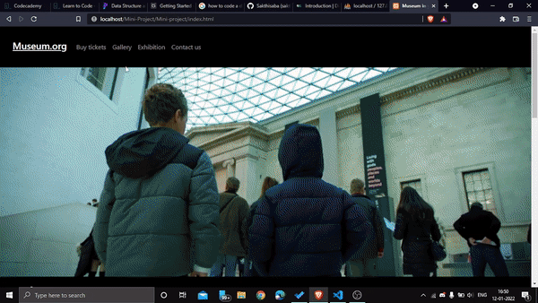

<h1>Hi this is developer of this project! </h1>
<vr>

<h2>Steps to run this website 
1.Install xampp  
2.Go to Localdisk C > xampp > htdocs  
3.Place the project file in htdocs folder  
4.Goto Start menu and search for xampp application.  
5.After opening ,Start the Apache and MYSQL server.  
6.Go to admin of mysql(phpMyadmin) 
7.Create a database name-"museum" 
8.Go to import option and import "gallery.sql" and click "GO" 

That's it we almost done! 

Now goto this link! 

http://localhost/Mini-Project/index.html 
